= Creating a Component With Input

我們還沒有真正的對此應用程式做很多事情，但程式碼和模板都已經變得有點混亂了。我們有三個不同的部分，用戶的輸入、filter 和顯示 items 陣列，這三個部分本質上都用自己的功能，他們都有共同的 items 陣列，但是用該陣列做不同的事。

我們出自不同的原因使用元件，使用元件也是因爲他可以讓我們的應用程式組由更小的模塊組成，這將使得開發和維護更加容易，所以從這節課開始，我們將各個部分元件化，這裏我們從清單開始，也就是一下這部分：

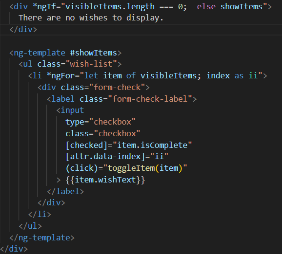

Angular CLI 提供我們一個非常方便的創建原件的指令 ng generate component ，該指令用於自動生成新的 Angular 元件。這個指令能夠幫助開發人員快速生成元件的基本結構，包括 TypeScript 檔案、HTML 模板、CSS 樣式以及測試檔案，使得元件的創建過程更加便捷和一致。

我們在終端輸入以下指令，表示創建一個名為 "wish-list" 的元件：

[source,cmd]
----
ng generate component wish-list
----

完成後可以在終端看到有4個檔案被創建還有一個檔案被更新：

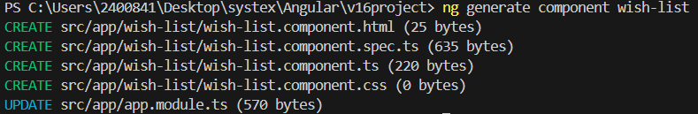

新創建的檔案位於一個名爲 app-list 的資料夾底下，該資料夾是 app 的一個子目錄。

* wish-list.component.html：用於定義元件的模板，這裡面可以編寫 HTML 標籤來顯示數據和控制元件的視圖。

* wish-list.component.css：用於定義元件的樣式，這些樣式只對這個元件生效，保證了樣式隔離。

* wish-list.component.ts：包含 WishListComponent 的類定義和邏輯。通常包括屬性和方法，以控制元件的狀態和行為。

* wish-list.component.spec.ts：用於測試 WishListComponent，確保元件的功能按預期工作。

關於更新的檔案app.module.ts，他是應用的根模塊，CLI 已經自動把 WishListComponent 添加到了模塊的 declarations 中，這樣該元件可以在應用中被使用。

將願望清單的程式碼剪下貼到 wish-list.component.html 中，在原本的位置用一對 "wish-list" 標簽代替，並且將 visibleItems 賦值到該元素的 "wishes" 屬性上：

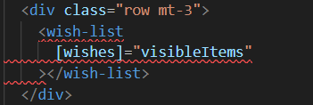

來到 wish-list.component.html ，將對應的部分改成新的屬性名 "wishes"

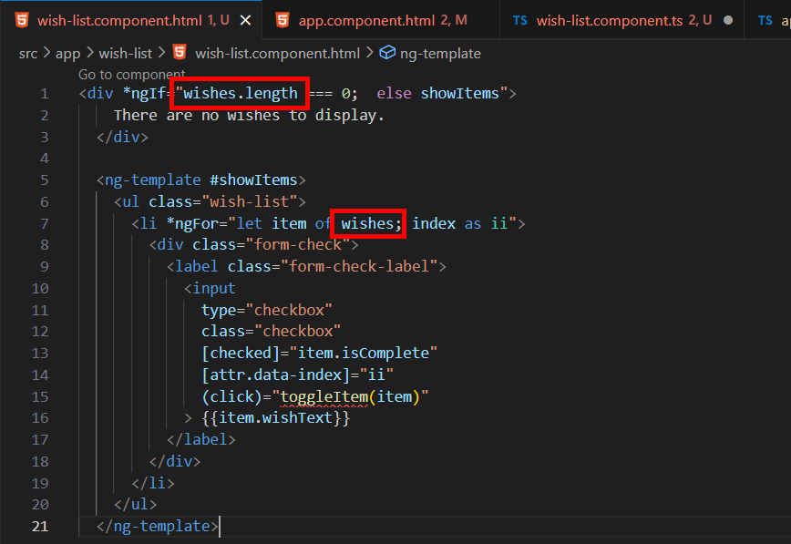

這邊我們也需要 toggle 方法，我們將 app.component.ts 中的該方法剪下並貼到 wish-list.component.ts 中，同時導入 WishItem 類別：

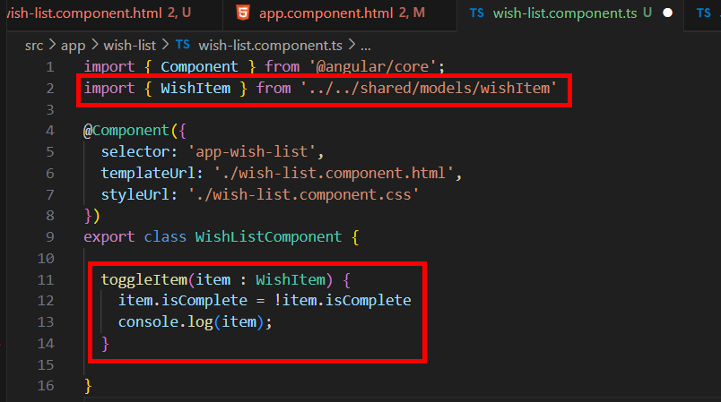

現在 app.component.ts 中還有兩個 Error ，一個是標簽名的問題：

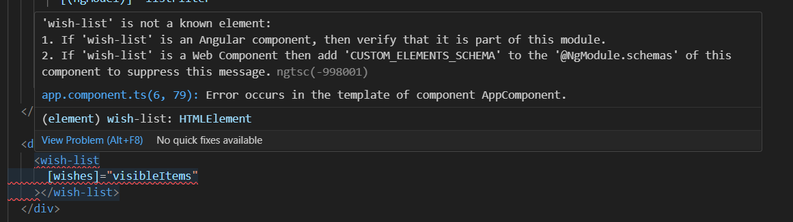

我們可以看到 Error 上寫說 wish-list 不是一個已知的元素，但我們剛剛不是才創建他了嗎？我們回到 wish-list.component.ts，會發現 selector 名為 "app-wish-list":

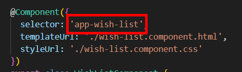

之所以有這個 app 前綴是因爲這是 app 模塊，爲了防止命名衝突自動幫我們添加的結果，我們將其該為 "wish-list" 即可：

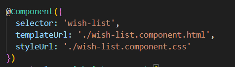

現在只剩 app.component.html 和 wish-list.component.html 中 Error 了：

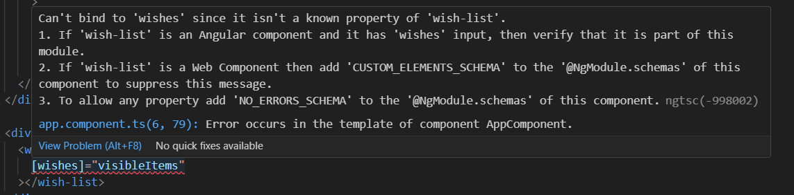

該 Error 顯示其無法綁定到 wishes ，因爲他不是 wish-list 的已知屬性，這很合理，因爲我們確實還沒定義這個屬性，我們將該屬性添加上去，wishes 是一個 WishItem[] 型別的一個陣列：

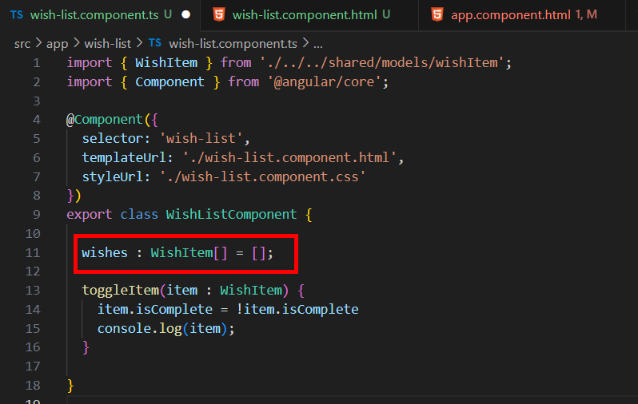

不過這麽做只會消除 wish-list.component.html 中的 Error，app.component.html 中的 Error 並沒有被解決，這牽扯到原件輸入的問題，我們必須明確的定義 wishes 是用來輸入的，所以我們要在 wish-list.component.ts 中的 wishes 前使用 "@Input" 裝飾器:

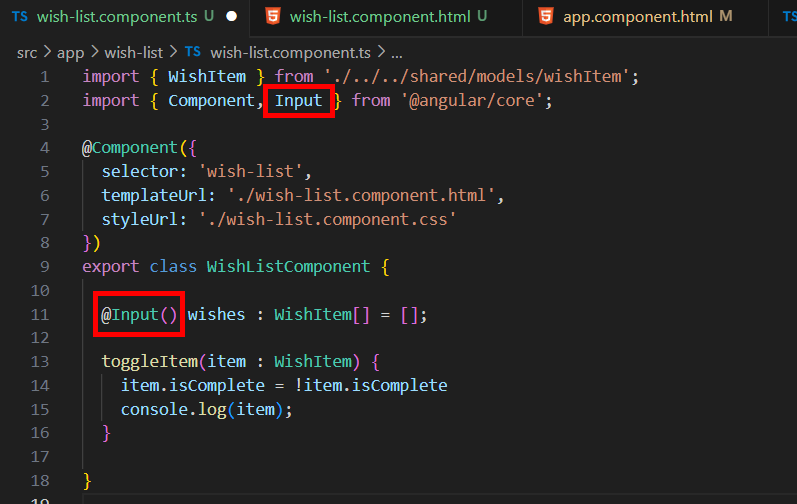

如此一來程式就可以正常運行了，我們可以將原先的 css 程式碼貼過來稍微美化一下：

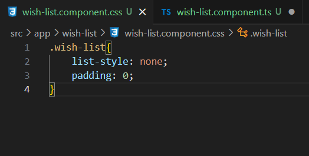

在 Angular 中，@Input 是一個裝飾器，用於把一個父元件的數據傳遞給其子元件。通過 @Input，可以實現父子元件之間的數據傳遞，使父元件可以將值傳遞給子元件的屬性，從而讓子元件可以接收到外部傳遞進來的數據。