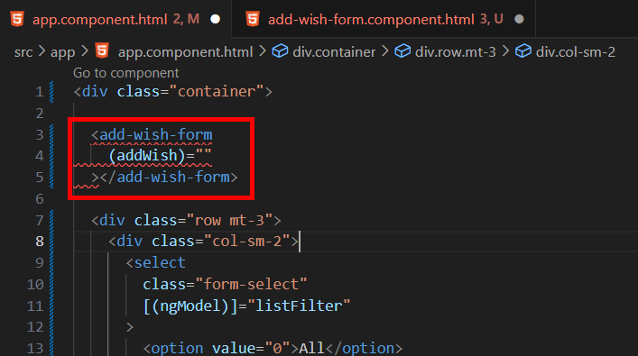

= Outputing Information from a Components

現在我們將改寫成元件的部分是輸入的表單，這部分與願望清單略有不同，因爲這裏沒有 input 而是 output，當我透過這個原件新增願望時，他必須要告訴他的父元件 app component 新增的内容。

我們通過以下指令創建新的元件：

[source,cmd]
----
ng generate component add-wish-form
----

接著我們將 app.component.html 中表單部分的程式碼剪下並貼到 add-wish-form.component.html 中：

在 app.component.html 寫上元件標簽，並且定義一個名爲 "addWish" 的事件：

接著我們將 app.component.ts 中的 newWishText 和 addNewWish() 剪下並貼到 add-wish-form.component.ts ，再進行如下的改寫：

* 重新命名 selector 為 "add-wish-form"

* 定義 addWish 事件，該事件是 EventEmitter 實例化的輸出事件，類型為 WishItem ，表示當事件被發出時，它會攜帶一個 WishItem 類型的數據，@Output()裝飾器標記了 addWish 為輸出屬性，它用於發送事件給父元件，
父元件可以通過監聽這個 addWish 事件來獲取新的願望項。

* addNewWish()中使用 emit() 方法發出 addWish 事件，並將新創建的 WishItem 作為參數發出。

再回到 app.component.html 中完善該事件：

如此一來輸入表表單也成爲了一個原件了。