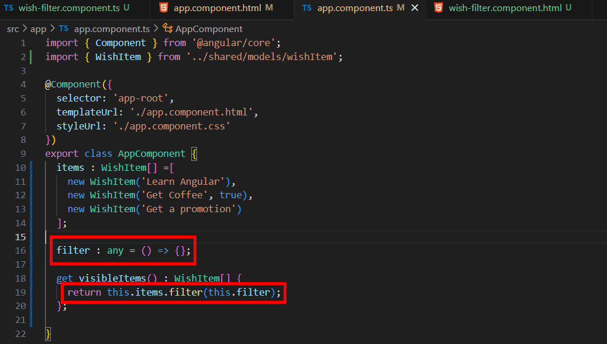

= Initializing Component Functionality

接下來我們要將篩選器的部分也寫成元件，透過以下指令創建元件：

[source,cmd]
----
ng generate component wish-filter
----

同樣的，我們將 app.component.html 中篩選器的程式碼剪下並貼到 wish-filter.component.html ，這裏我們將使用 ngModelChange 來實現，我們添加名爲 changeFilter 的方法，用來為我們的模塊提供新值：

在 app.component.html 中原先篩選器的部分改用 wish-filter 標簽代替，同時定義一個名爲 "filter" 的事件：

接著將 app.component.ts 中的 filters 陣列和 listFilter 剪下並貼到 wish-filter.component.ts ,再進行一下的改動：

* 重新命名 selector 為 "wish-filter"

* EventEmitter<any>()：創建了一個新的事件發射器，用於發送過濾條件，並標記為 @Output，用於向父元件發送事件。

* changeFilter方法用於過在濾條件改變時更新過濾器，當過濾條件改變時，通過 emit() 方法將選擇的過濾函數發送給父元件，從而讓父元件可以根據這個過濾條件更新顯示的願望清單。

接著我們在 app component 上新增一個 filter 屬性，並且修改 getter:

* filter 是一個屬性，它是一個函數，用於過濾 items 中的項目。
默認情況下，這個過濾器是空的函數（() => {}），即它不會對 items 做任何過濾。這個屬性會從子元件中傳遞過來，並且會根據需要應用過濾邏輯。

* visibleItems 是一個 getter 方法，它返回當前過濾後的可見項目列表，
filter() 方法來過濾 items 數組中的項目，意味著 visibleItems 會根據當前的 filter 返回滿足條件的項目。

回到 app.component.html 完善 filter 事件：

* 當子元件 WishFilterComponent 發出 filter 事件時，這個事件綁定會將事件中傳遞的數據賦值給父元件的 filter 屬性。

現在我們打開瀏覽器會發現初始的 All 願望清單是空的：

這是因爲我們目前寫的濾器初始值是空的函數（() => {}），因此當他被傳遞給 items 陣列上的 filter 方法（items.filter(this.filter)）時會回傳 undefined ，所以一開始不會有任何願望被展示。

我們可以透過幾種不同的方式解決這個問題，我們可以將過濾器的函數改爲 return true 來解決:

[source,typescript]
----
filter : any = () => true;
----

不過這裏要使用另一個方法解決，我們使用 Angular 提供的一個生命週期鈎子 ngOnInit() ，使用方法如下：

在元件初始化時，通過 ngOnInit() 方法發出一個默認的過濾條件，這樣父元件在頁面加載時就可以根據這個過濾條件來顯示相關的項目。父元件在加載 WishFilterComponent 時，可以立刻獲取到初始過濾器，並應用到它的項目列表中。這樣即使用戶還沒有手動選擇過濾條件，應用也會顯示一個預設的結果。

通過在 ngOnInit() 中執行初始設置、從服務中獲取數據或啟動某些操作，可以確保元件在渲染之前已經準備好了。它與 constructor() 的區別在於，constructor() 用於注入依賴，而 ngOnInit() 是專門用於元件初始化時的邏輯設置。使用 ngOnInit() 可以使代碼更具結構化，有助於保持良好的代碼組織和可維護性。
