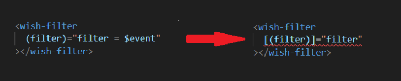

= Setting Up Two-Way Binding

我們現在瞭解了有關元件的 input 和 output，現在我們再復習一下數據在元件之間的傳遞，我們打開 app.component.html：

在這裏 app 是父元件，wish-list 是一個擁有 @input 屬性（wishes）的子元件，而我們將父元件（app component）中的 items 綁定到該屬性上，在這個情況下數據流是從父元件流向子元件，而且我們也可以繼續將這些數據往下傳，這將在後續的課程中實踐。

我們再將目光放到 add-wish-form 和 wish-filter 元件上，我們分別創建了 addWish 和 filter 事件，這兩個事件被觸發時都會發送數據，這裏的數據流是從子元件流向父元件。

打開 wish-filter.component.html ，我們可以看到 ngModel 的不同，從語法也可以看出來，他同時使用了屬性綁定和事件綁定，這意味著他是一個雙向綁定。

現在要做的事是把 wish-filter 也改成雙向綁定，這麽做的原因是因爲當 filter 事件觸發時，這裏做的只是將 app component 中的 filter 屬性賦值成通過 $event 提供的對應的篩選函式，所以在這種情況我們可以用雙向綁定輕鬆實現。

這樣的更改也可以簡化 app component 中的 filter

現在我們只需要在 wish-filter.component.ts 做以下更改：

* 爲了實現雙向綁定，我們要做的是在元件上同時使用 @Input 和 @Output 裝飾器，Input 將是屬性的名稱，這邊我們取為 "filter" 並定義為 any 型別，這邊要特別注意的是，關於 Output 的命名，因爲 Angular 會識別出輸入和輸出是連結在一起的，所以 Output 的名稱要與 Input 相同並在後面加上 "Change" ，如此一來 Angular 將識別到這是一個雙向綁定。

* 我們也把 changeFilter() 重新命名為 updateFilter() 讓其更符合現在的場景，當執行 updateFilter() 時，我們將 filter 的屬性賦值為新的值，接著再發出 filterChange 事件，所以我們將 filter 屬性作爲 event 物件傳入。

* OnInit 也由原來的發出 filterChange 改爲調用 updateFilter()，這裏我們傳入字串 '0' ，表示預設篩選器為 All 。

接著我們再更新 wish-filter 的模板，我們來到 wish-filter.component.html:

在 ngModelChange 事件上調用此 updateFilter 方法就可以實現了。

最後我們再總結一下這是怎麽運作的，在 app component 上我們定義了型別為 any 的屬性 "filter" ，我們將此屬性綁定到 wish-filter 上的 "filter" 屬性，因此當我們的程式首次運行時，他將採用此 filter 屬性的值，並且將其向下傳遞給子元件（wish-filter）的 filter 屬性，所以最初 wish-filter 元件上的 Input 篩選器是 undefined，這不是因爲我們在這裏沒有定義，而是因爲他綁定到 app 元件的 filter 屬性，該屬性為 undefined ，但是當 ngOnInit 觸發時，會執行 updateFilter() ，這時 wish-filter 的 filter 屬性會更改為更新的 filter，再將該filter屬性透過 filterChange 發出，這樣又反過來更新了 app 元件上的 filter 屬性。