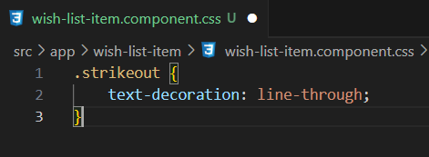
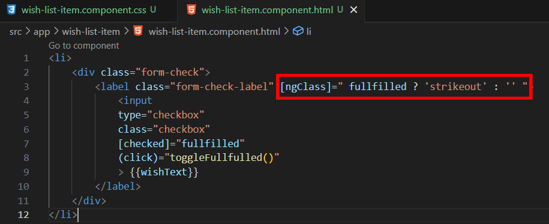
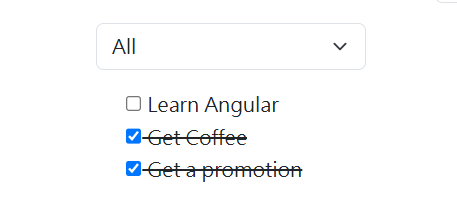
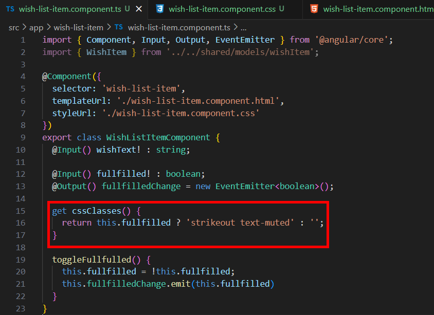
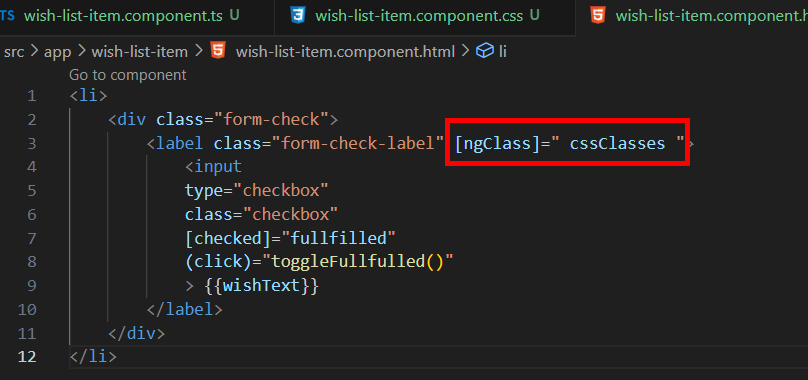
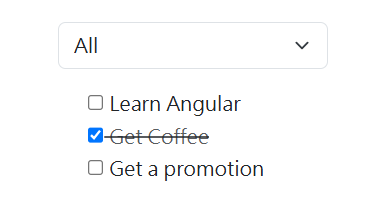
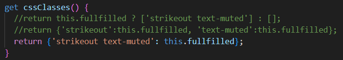

= Styling Components

圖形化應用程式的一大優點是可以在不使用任何文本的情況下向使用者傳達資訊，就比如這邊我們複選框的勾選與否對應的是願望是否實現，不過如果我們將實現的願望文字顔色變淡且再加上一條橫穿文字的中綫，這樣可以讓我們的應用程式使用起來更加直觀易懂。

我們在 wish-list-item.css 定義一個名爲 "strikeout" 的樣式類別：

ngClass 是 Angular 提供的一個指令，用於在模板中根據特定的條件來動態地添加或移除 CSS 類名，這邊我們先簡單使用一個三元表達式在 label 標簽上使用該樣式類別：

實現的結果如下：

不過這種程式碼有點難以閲讀，在 HTML 中使用簡單易懂的模板往往比大量的 JavaScript 表達式來的好，所以我們可以在 component 中定義一個名爲 "cssClasses" 的 getter ，另外多新增一個 brootstrap 中的 twxt-mute 屬性:

並在模板中使用：

如此一來便可以在功能實的同時現模板程式碼簡潔的效果：

另外 ngClass 可以接受多種形式的參數（字符串、數組、物件），使得樣式控制變得更加靈活：

