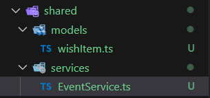
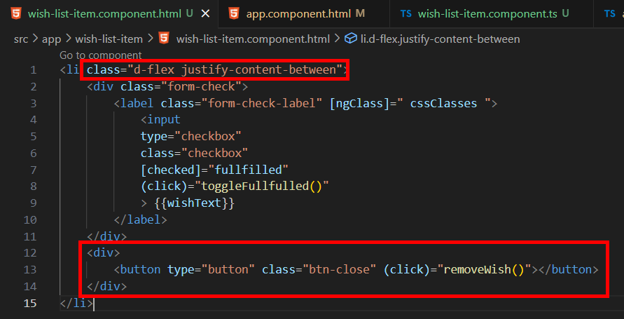
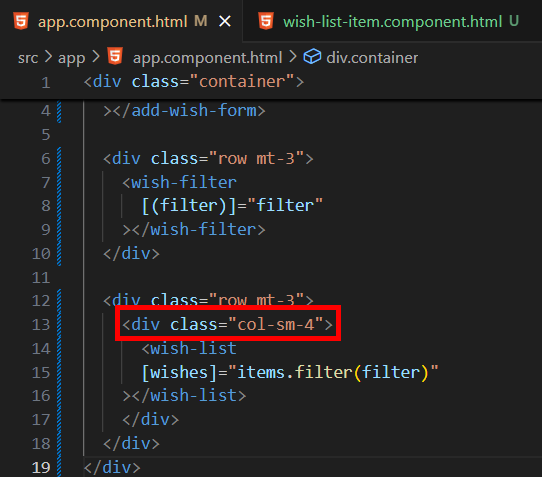
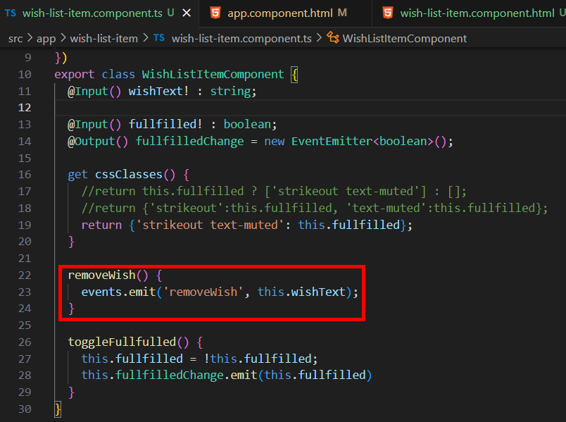
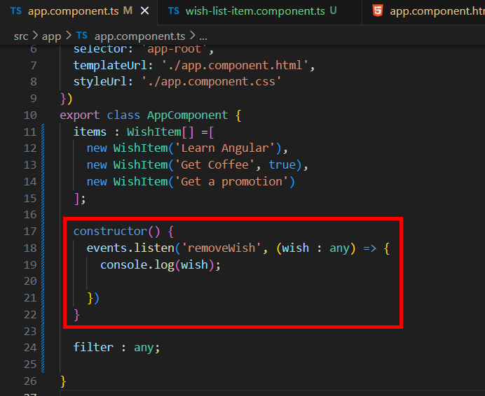
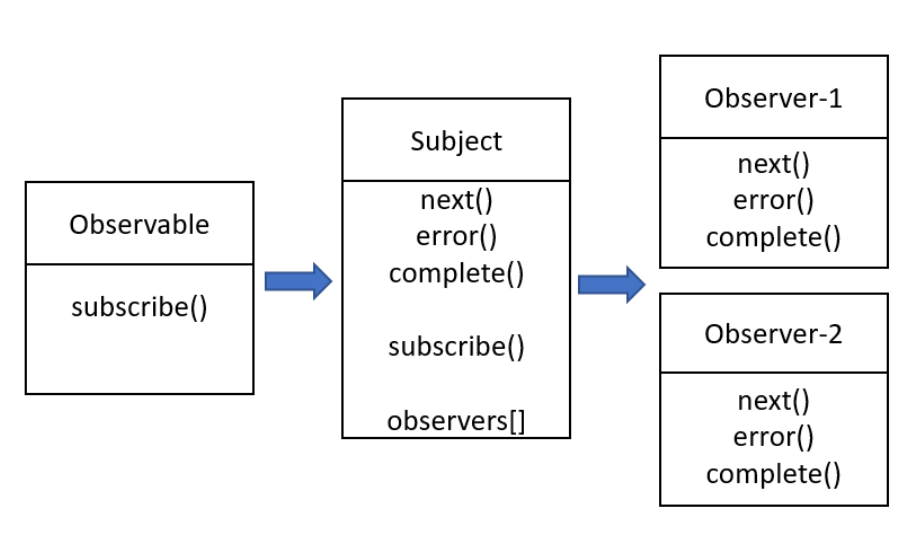
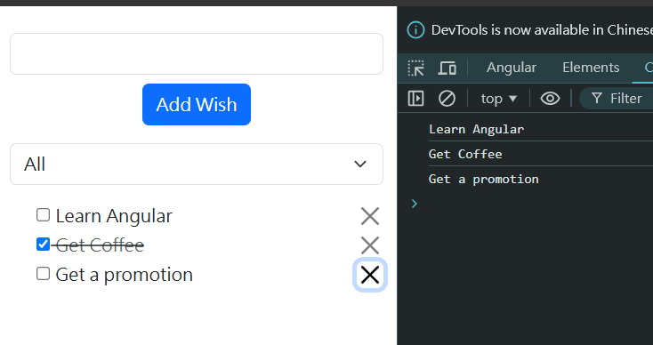

= Using Observables to Create an Event Bus

現在我們要添加一個從願望清單中刪除單個願望的功能，這意味著我們要在每個 list 後添加一個按鈕，每當按鈕被點擊時會出發一個事件，現在的問題是如果要對願望的陣列進行操作，我們必須在 app 元件中實現，因爲我們是在那裏定義 WishItem[] 的，因爲 app 原價和 wish-list-item 元件沒有直接的關係，所以我們不能在 wish-list-item 元件中定義一個事件並讓其在 app 元件中監聽。

我們可以用兩種方式來實現，一種是在 wish-list-item 元件中定義一個 "removeItem" 事件，觸發該事件後並在 wish-list 元件中監聽，再將其向上傳到 app 元件中處理，很明顯這種方式的擴展性很差，尤其對於大型的專案。

另一個解決方法是創建一個事件總綫（Event Bus），他是一個全域的物件允許應用程式在任何地方監聽事件，我們可以使用觀察者物件（Observable Objects）來做到這一點。

Observable 是 RxJS（Reactive Extensions for JavaScript）庫提供的一個重要概念，可以用來表示流數據，並且允許你在時間軸上監聽和處理數據事件，其基本作用是發送數據流（Stream），並允許觀察者（Observer）訂閱和處理這些數據。

我們先在 share 目錄地下創建一個 "services" 的資料夾，再在其底下新建一個名爲 "EventService" 的 TypeScript 檔：

在 wish-list-item.component.html 中為 li 標簽新增 brootstrap 的類別，再添加一個刪除按鈕，並在該按鈕上綁定一個點擊事件：

app.component.html 中的 wish-list 也做相應的調整

在 wish-list-item.component.ts 中定義該點擊事件綁定的方法，該方法中寫了一個名爲 "events" 的 event service ，其有一個名爲 "emit" 的方法用來發出 "removeWish" 事件，這邊我們先將 this.wishText 作爲我們的 event 物件傳入：

接著我們在 app 元件中編寫監聽該事件的程式碼，我們可以在建構子中執行該操作，建構子中 events 調用其 "listen" 方法用於監聽 "removeWish" 事件，並透過一個内聯回調函數得到監聽的結果 "wish" :

這邊我們先對 Subject 有一個初步的概念，他是 RxJS 中一種特殊的 Observable，既可以發送數據，也可以被訂閱。普通的 Observable 是單播的，每個訂閱者都會獲得自己的數據流，而 Subject 是多播的，所有訂閱者共享同一個數據流。

* Subject 在這裡扮演了一個代理的角色，它訂閱了一個 Observable，並且可以將這個 Observable 的數據流發送給多個訂閱者。

* next()、error()、complete() 方法：
Subject 也可以通過這些方法手動發送數據、錯誤和完成的通知。

* subscribe() 方法：
當其他 Observer 訂閱 Subject 時，它們都會收到相同的數據流。

* observers[] 列表：
Subject 內部保存了一個 observers 的列表，所有訂閱這個 Subject 的訂閱者都會被添加到這個列表中。當 Subject 發送一個新數據時，列表中的每個 Observer 都會收到該數據。

最後我們到 EventService 中實現這些 API：

[source,typescript]
----
import { Observable, Subject } from "rxjs";

class EventService {
    private subject = new Subject();

    emit(eventName: string, payload: any) {
        this.subject.next({eventName, payload});
    }

    listen(eventName: string, callback: (event: any) => void) {
        this.subject.asObservable().subscribe((nextObj : any) => {
            if(eventName === nextObj.eventName) {
                callback(nextObj.payload);
            }
        });
    }
}

export default new EventService();
----

* emit(eventName: string, payload: any)：
用於發送事件。

- eventName：事件的名稱，用來識別是哪個事件。

- payload：事件的數據（負載），可以是任何類型。

- this.subject.next({eventName, payload});：通過 next() 方法向 subject 發送事件對象，對象包含 eventName 和 payload。

* listen(eventName: string, callback: (event: any) => void)：
用於監聽特定名稱的事件。

- eventName：要監聽的事件名稱。

- callback：當指定的事件被發送時要執行的回調函數。

- this.subject.asObservable()：將 subject 作為 Observable 使用，這樣只能訂閱不能直接使用 next()。

- subscribe()：訂閱 Observable，每次有數據發送時都會執行回調。

- if (eventName === nextObj.eventName)：只在 eventName 與發送的事件名匹配時，才執行回調函數。

最後我們回到 app.component.ts 和 wish-list-item.component.ts import 這個 events 就可以使用了：

