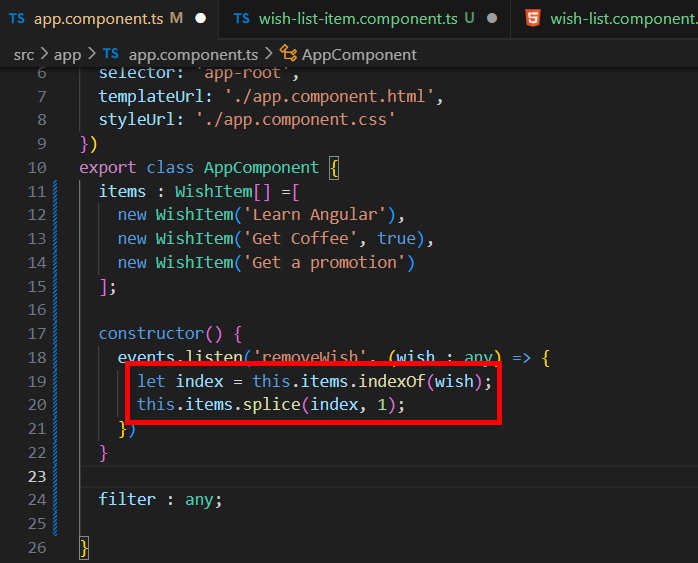

= Refactoring the WishListItem Component

接下來要完成刪除願望的功能，我們需要一些方法來確定我們要刪除的願望，其中一種方法是為每個願望提供唯一的識別碼，不過這裏我們將使用另一種方式實現。

因爲現在的 wish-list-item 元件只使用了 WishItem 的部分（wishText、isConplete），我們將改造原來的程式碼，改成直接操作 WishItem 物件，這樣要實現刪除的功能也更加容易，也可以透過該物件執行原先的操作：

[source,typescript]
----
import { Component, Input, Output, EventEmitter } from '@angular/core';
import { WishItem } from '../../shared/models/wishItem';
import events from './../../shared/services/EventService';

@Component({
  selector: 'wish-list-item',
  templateUrl: './wish-list-item.component.html',
  styleUrl: './wish-list-item.component.css'
})
export class WishListItemComponent {
  @Input() wish! : WishItem;

  get cssClasses() {
    return {'strikeout text-muted': this.wish.isComplete};
  }

  removeWish() {
    events.emit('removeWish', this.wish);
  }

  toggleFullfulled() {
    this.wish.isComplete = !this.wish.isComplete;
  }
}
----

我們將原本的 "wishText" 屬性改成 "wish" 並直接綁定 WishItem 物件，也刪掉了 "fullfilled" 雙向綁定，removeWish() 中直接傳入 WishItem 物件，getter 和 toggleFullfulled() 也做了相應的處理。

對應的模板改造如下：

[source,html]
----
<li class="d-flex justify-content-between">
    

        <label class="form-check-label" [ngClass]=" cssClasses ">
            <input 
            type="checkbox" 
            class="checkbox"
            [checked]="wish.isComplete"
            (click)="toggleFullfulled()"
            > {{wish.wishText}}
        </label>
    

    

        <button type="button" class="btn-close" (click)="removeWish()"></button>
    

</li>
----

wish-list.component.html 也做如下的改變：

[source,html]
----

  There are no wishes to display.

<ng-template #showItems>
  <ul class="wish-list">
    <wish-list-item
      *ngFor="let wish of wishes"
      [wish]="wish"
    ></wish-list-item> 
  </ul>
</ng-template>
----

如此一來我們便可以在 app 元件中直接操作 WishItem 物件了：

