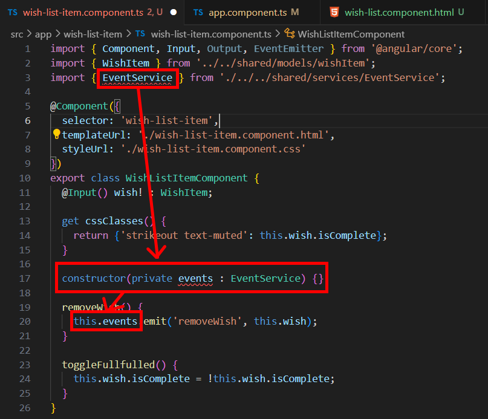
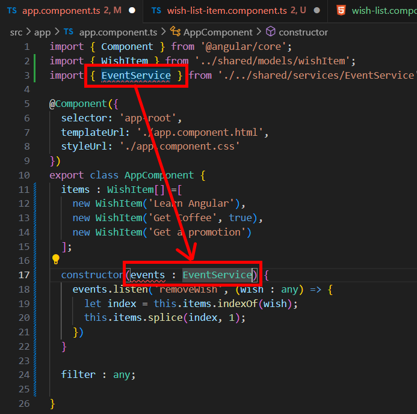
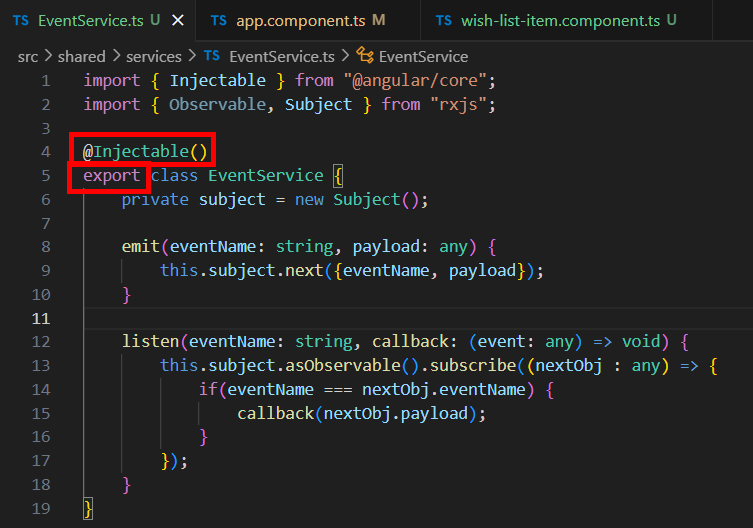
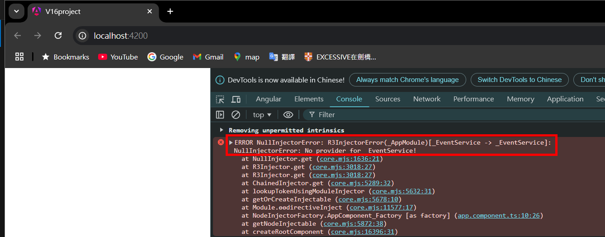
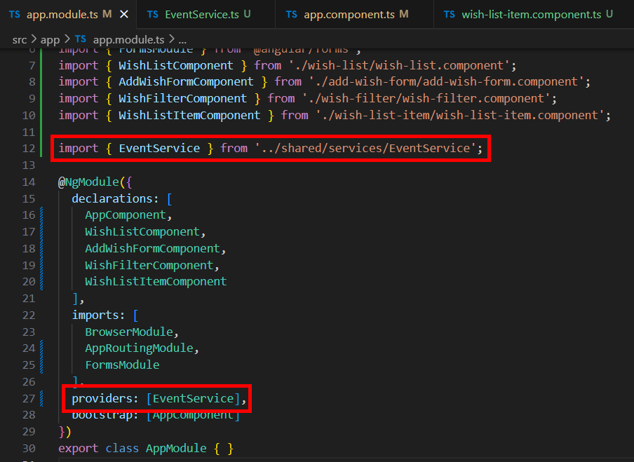
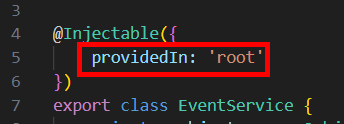

= Injecting Dependencies

我們寫了一個 EventService 類別，並創建了一個實際的物件導出，在 app 元件和 wish-list-item 元件中導入該物件 "events" 用來監聽 removeWish 事件及發出該事件，這個 events 物件就是該兩個元件的依賴項，目前的寫法會讓程式的維護和更新變得困難，因爲我們在使用該服務時都會實際創建一個物件。

使用依賴注入可以很好的解決這個問題，我們不用自己創建依賴項，而是直接告訴 Angular 我們想要使用什麽，他會自動為我們注入該依賴項。

改寫 wish-list-item 元件，讓他直接導入 EventService 類別，並在建構子中注入該類別型別的事件 "events" ，並定義為 private 表示 events 屬性是私有的，只能在這個類別內部訪問：

同理 app 原件：

在 EventService 中，將原先最後一行導出物件的程式碼刪掉並直接將整個 class 導出，並在其上方添加 @Injectable 裝飾器函數，用來告訴 Angular 這個類別可以作為依賴項來注入到其他類別中：

接著我們執行程式，發現沒有任何畫面，同時顯示如下的 Error ：

我們有兩種解決方式，一種是在 app.module 中導入該類別，並將其添加到 providers 陣列中：

還有一種方法是在 @Injectable 裝飾器函數中直接指定注入的位置， root 是默認設置，表示服務在應用的根層級上提供，這樣的設定使得該服務可以被應用程式中的任何元件或服務使用。

如此一來我們就將該服務以依賴注入的方式實現了。