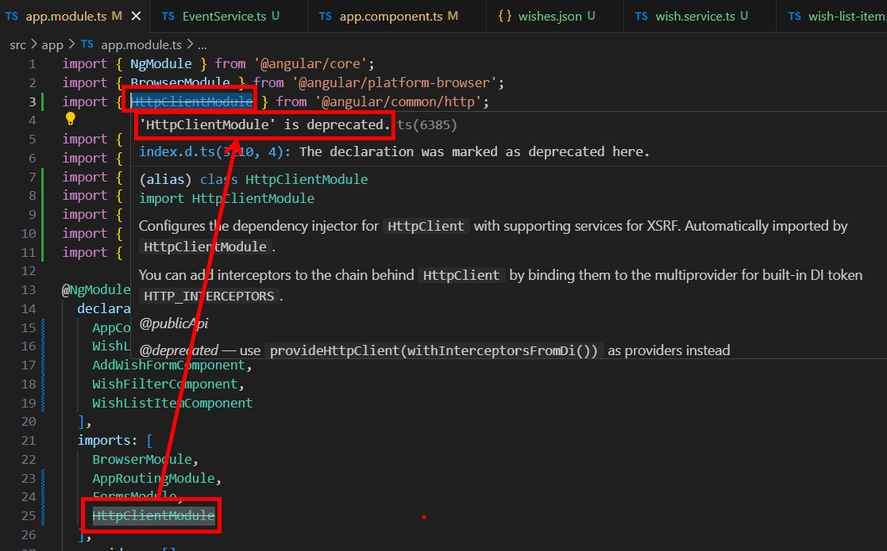
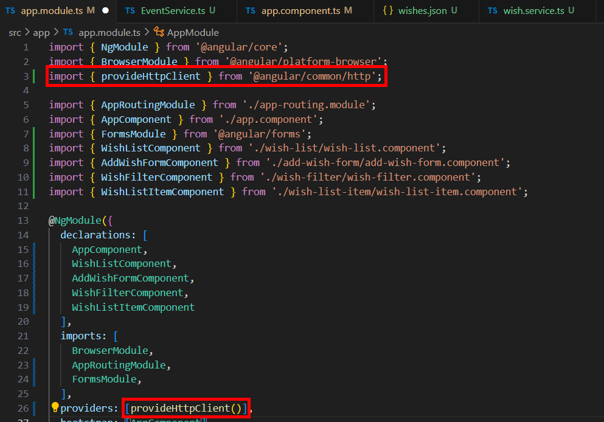

= Issuing HTTP Requests

在用戶端應用程式中最常見的事情之一就是交互，我們發出 HTTP 請求來獲取或操作數據，這裏 Angular 和其他 UI 框架不同的是，他有内建的 HttpclientModule 可以使用，不過值得注意的是，從 Angular 18 開始，HttpclientModule 已經被官方棄用了：

取而代之的是 provideHttpClient ，我們在 app.module.ts 引入:

接著我們在 Mockoon 中使用一下 JSON 格式的數據來模擬後端傳來的數據：

[source,json]
----
[
    { "wishText": "Learn Angular", "isComplete": false},
    { "wishText": "Get Coffee!!!", "isComplete": true},
    { "wishText": "Get a promotion", "isComplete": false}
]
----

我們現在要建立一個 service ，其實 Angular 也有提供相應的指令，而不需要我們手動建立：

[source,cmd]
----
ng generate service Wish
----

打開所創建的 wish.service.ts，完善如下：

[source,typescript]
----
import { Injectable } from '@angular/core';
import { HttpClient } from '@angular/common/http';

@Injectable({
  providedIn: 'root'
})
export class WishService {

  constructor(private http: HttpClient) {}

  getWishes() {
    return this.http.get('http://localhost:3001/');
  }
}
----
 * 引入了 HttpClient 並在建構子中注入。

 * 定義了一個 getWishes() 方法，從指定的 URL 調用 http 的 get 方法，其返回的值為一個 observable 物件，要注意的是，這裏雖然調用了 get 方法，但是實際的請求並沒有發送，只有調用了 observable 物件的 subscribe() 方法請求才會被發送。這裏的 URL 是 Mockoon 提供的。

app.component.ts 完善如下：

[source,typescript]
----
import { Component, OnInit } from '@angular/core';
import { WishItem } from '../shared/models/wishItem';
import { EventService } from './../shared/services/EventService';
import { WishService } from './wish.service';

@Component({
  selector: 'app-root',
  templateUrl: './app.component.html',
  styleUrl: './app.component.css'
})
export class AppComponent implements OnInit{
  items : WishItem[] = [];

  constructor(events : EventService, private wishService : WishService) {
    events.listen('removeWish', (wish : any) => {
      let index = this.items.indexOf(wish);
      this.items.splice(index, 1);
    })
  }

  ngOnInit(): void {
    this.wishService.getWishes().subscribe((data : any) => {
      this.items = data;
    });
  }

  filter : any;

}
----

* 定義 items 為一個 WishItem 型別的陣列，付出存放外部傳來的數據。

* 導入 WishService 並在建構子中注入

* 在 ngOnInit() 中發出 HTTP 請求，我們在這裏使用 WishService 的 getWishes() 方法，並透過 subscribe() 方法發送請求，同時定義回調函數用於取得數據。 

如此一來我們就實現看透過 HTTP 請求從外部獲取數據了。