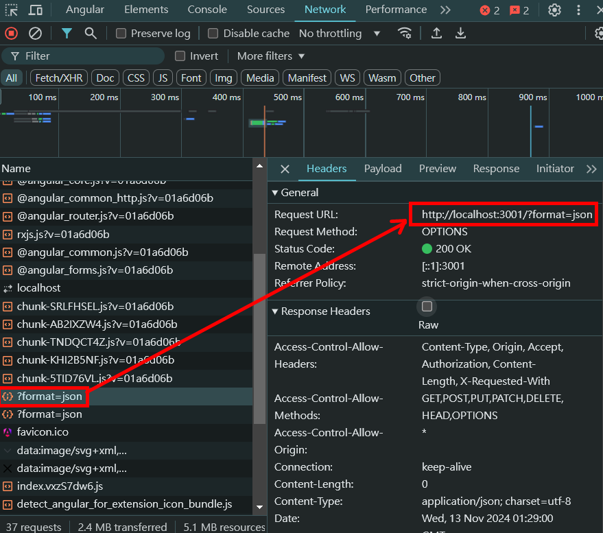

= Providing Options for HTTP Requests

當涉及到 HTTP 請求時，其實很少只發送簡單的 get 請求，通常在發送請求時會提供一些選項，比如 header 、 token 等。

這邊我們將稍微帶過應該如何使用：

[source,typescript]
----
import { Injectable } from '@angular/core';
import { HttpClient, HttpHeaders, HttpParams } from '@angular/common/http';
import { WishItem } from '../shared/models/wishItem';

@Injectable({
  providedIn: 'root'
})
export class WishService {

  constructor(private http: HttpClient) {}

  private getStandardOptions() : any {
    return {
      headers: new HttpHeaders({
        'Content-Type': 'application/json',
      })
    }
  }

  getWishes() {
    let options = this.getStandardOptions();
    options.params = new HttpParams({
      fromObject: {
        format: 'json'
      }
    }) 
    return this.http.get('http://localhost:3001',options);
  }

  private addWish(wish: WishItem){
    let options = this.getStandardOptions();
    options.headers = options.headers.set('Authorization', 'value-need-for-authorization');
    this.http.post('http://localhost:3001', wish, options)
  }
}
----

