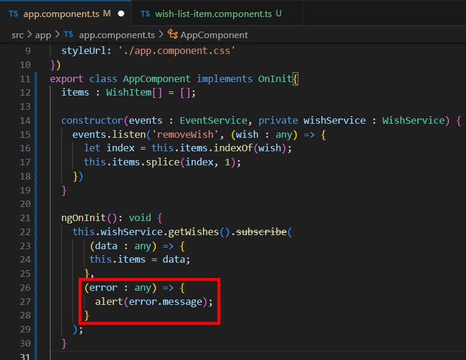
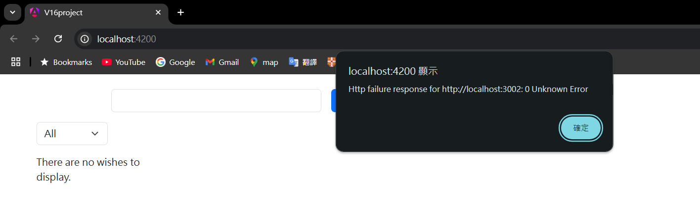
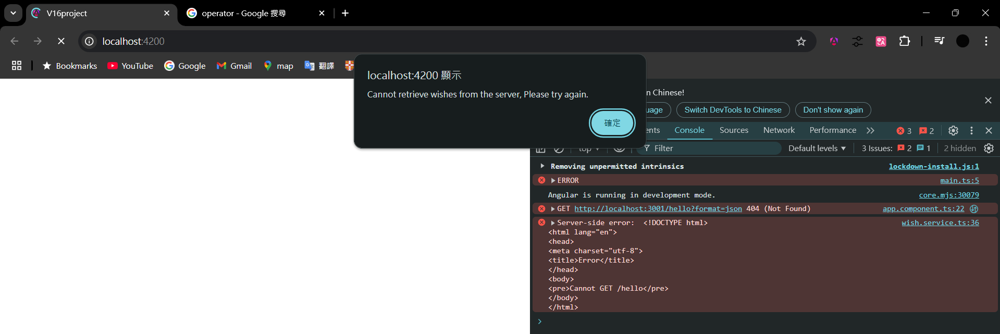

= Handling Errors for HTTP Requests

這邊我們要介紹有關 HTTP 請求的錯誤處理，我們回到 app 元件，在 subscribe 中提供第二個回調函數作爲參數，這個回調函數會在 HTTP 請求失敗時執行，error 代表了錯誤的信息：

當有錯誤發生時便會觸發該回調函數，例如我們更改成一個不存在的 URL ：

作爲開發人員，我們會希望錯誤發生時能獲得更多相關的資訊，這裏我們將介紹 RxJS 中的一個運算子（operator） "catchError" ，他可以在處理異步數據流的過程中優雅地處理錯誤，防止因為錯誤而導致整個流崩潰。catchError 操作符經常用於 Angular 的 HTTP 請求中，以便有效地捕獲和處理 API 請求中的錯誤，使用方法如下：

[source,typescript]
----
  getWishes() {
    let options = this.getStandardOptions();
    options.params = new HttpParams({
      fromObject: {
        format: 'json'
      }
    }) 
    return this.http.get('http://localhost:3001/hello',options).pipe(catchError(this.handleError));
  }

  private handleError(error: HttpErrorResponse) {
    if(error.status === 0) {
      console.error('There is an issue with the client or network: ', error.error);
    } else {
      console.error('Server-side error: ', error.error);     
    }
    return throwError(() => new Error('Cannot retrieve wishes from the server, Please try again.'))
  }
----

這邊使用的 pipe 是 RxJS 中的一個方法，可以在任何 Observable 上調用，他允許將多個運算子組合在一起，形成對數據流的處理鏈，這樣可以使程式碼更加清晰和模塊化。用來處理 Observable 流中的數據，類似於流水線，每一個運算子依次處理數據，最終將結果輸出給訂閱者。

