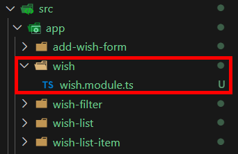
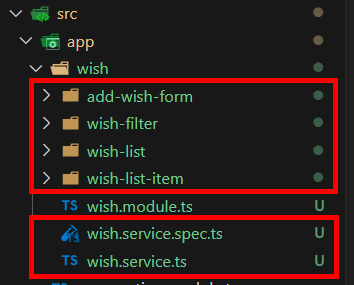

= Creatingh Modules

在建構應用程式時，不一定需要模塊，但他對大型的專案很有幫助 ，因爲他可以讓我們為關係密切的元件和功能創建一個容器，比如現在這個應用程式中，我們只專注於願望清單、展示願望已經如何操作他們，如果我們要為這個程式添加別的功能，比如聯係表這種與願望無關的功能，那麽我們模塊化就會是有意義的。

接下來我們將先前完成的部分模塊化，使用以下指令創建一個 wish 模塊：

[source,cmd]
----
ng generate module wish
----

我們可以在 app 底下看到新建的 wish 目錄：

接下來要做的就是將相關的元件都移到該目錄底下:

app.modules.ts 改動如下：

[source,typescript]
----
import { NgModule } from '@angular/core';
import { BrowserModule } from '@angular/platform-browser';

import { AppRoutingModule } from './app-routing.module';
import { AppComponent } from './app.component';

import { WishModule } from './wish/wish.module';

@NgModule({
  declarations: [
    AppComponent,
  ],
  imports: [
    BrowserModule,
    AppRoutingModule,
    WishModule
  ],
  providers: [],
  bootstrap: [AppComponent]
})
export class AppModule { }
----

wish.modules.ts 如下：

[source,typescript]
----
import { NgModule } from '@angular/core';
import { CommonModule } from '@angular/common';
import { FormsModule } from '@angular/forms';
import { provideHttpClient } from '@angular/common/http';

import { WishListComponent } from './wish-list/wish-list.component';
import { AddWishFormComponent } from './add-wish-form/add-wish-form.component';
import { WishFilterComponent } from './wish-filter/wish-filter.component';
import { WishListItemComponent } from './wish-list-item/wish-list-item.component';
import { WishService } from './wish.service';

@NgModule({
  declarations: [
    WishListComponent,
    AddWishFormComponent,
    WishFilterComponent,
    WishListItemComponent
  ],
  imports: [
    CommonModule,
    FormsModule
  ],
  exports: [
    WishListComponent,
    AddWishFormComponent,
    WishFilterComponent,
    WishListItemComponent,
  ],
  providers: [provideHttpClient(), WishService]
})
export class WishModule { }

----

再將各個路徑更改成正確的後，就完成了。