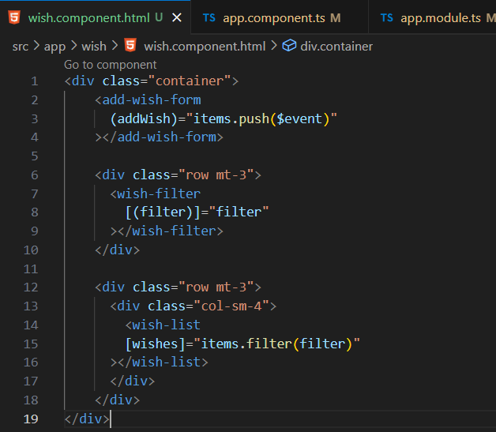
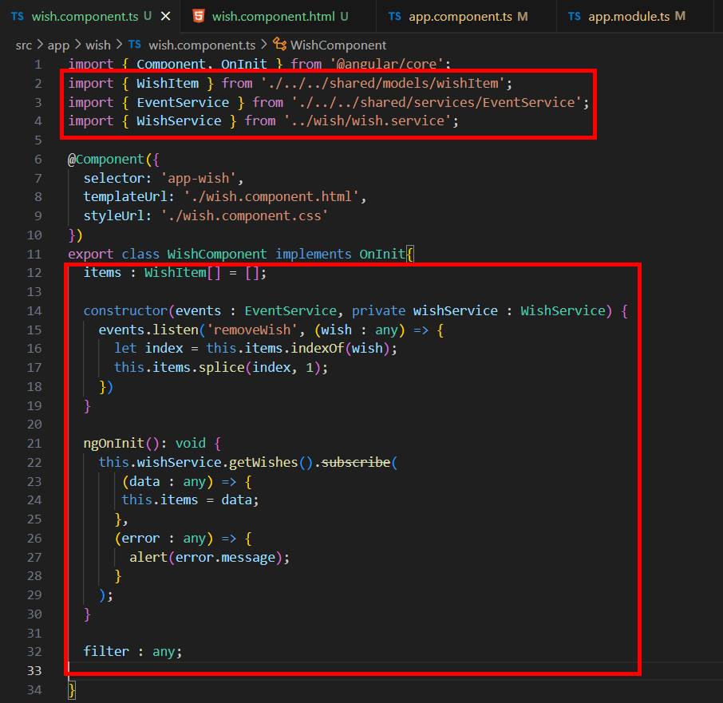
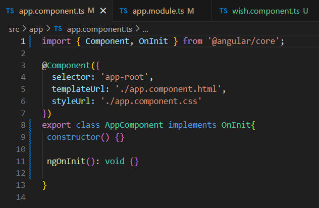
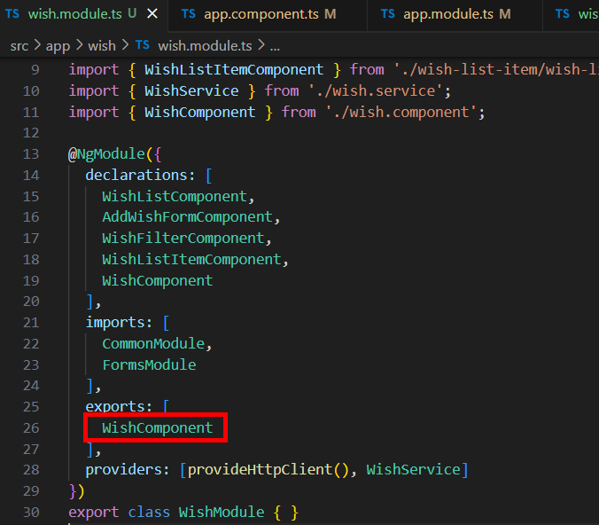
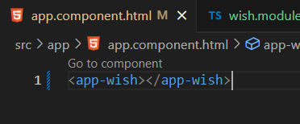

= Exporting Single Components

現在我們在 wish 底下新增一個 wish 元件，並將願望相關的元件都移到 wish 元件裏面，這樣我們在 app 元件中可以只使用 wish 元件展示該模塊，我們透過以下指令在 wish 目錄底下創建 wish 原件：

[source,cmd]
----
ng generate component wish -m wish
----

接著我們將 app.component.html 中的所有程式碼剪下並貼到 wish.component.html 中：

將 app.component.ts 中的相關程式碼剪下並貼到 wish.component.ts 並修正路徑：

此時的 app.component.ts 應該只會長這樣：

此時在 wish.component.ts 中我們只需要導出 WishComponent ：

如此一來我們在 app 模板中只需要使用 "app-wish" 標簽就可以展示該模塊了：

