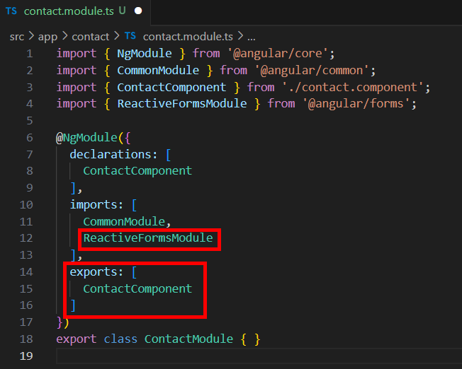
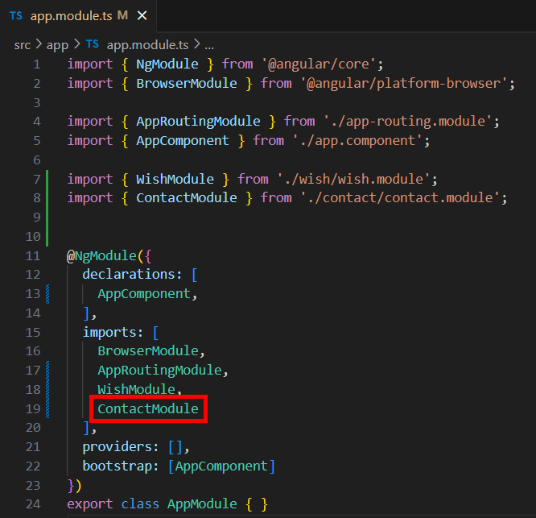
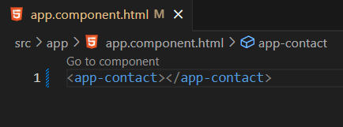
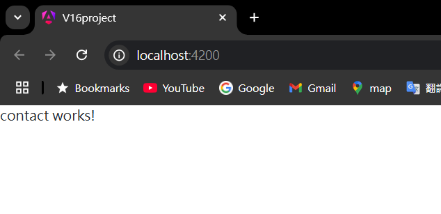
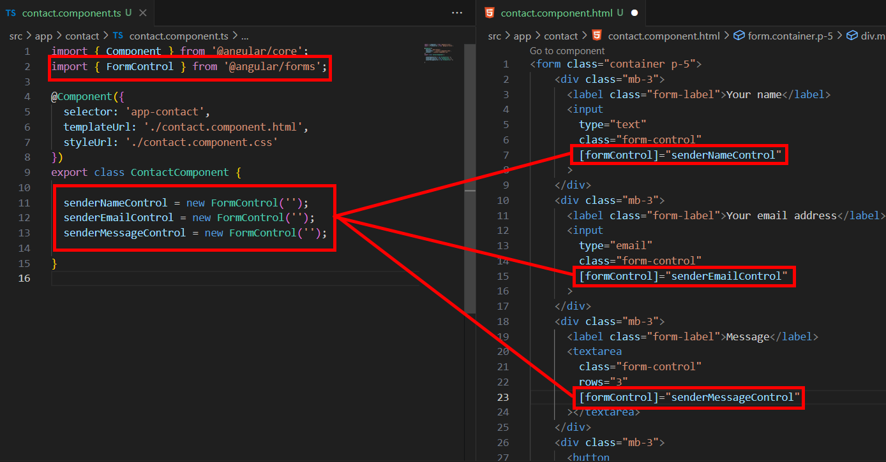
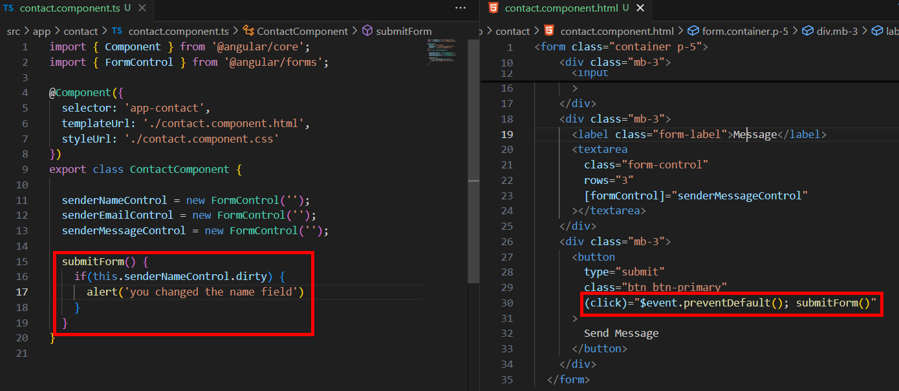

= Introducing Reactive Forms

先前我們使用模板驅動表單（template-driven forms）實現了輸入願望的功能，模板驅動適合用來創建簡單的表單，當應用程式的表單很大很繁重時，我們往往會使用回應式表單（reactive forms）來實現，因爲模板驅動的方法會影響性能，管理其背後的邏輯需要大量的開銷。

我們將新建另一個模塊，並在該模塊中使用回應式表單，我們新增一個名爲 "contact" 的模塊：

[source,cmd]
----
ng generate module contact
----

在該模塊底下創建一個名爲 "contact" 的元件：

[source,cmd]
----
ng generate component contact -m contact
----

在 contact.module.ts 中，有別於使用模板驅動表單時導入 "FormsModule" ，使用回應式表單我們導入的是 "ReactiveFormModule" ，同時我們將 contact 元件加到 exports 陣列中：

完成以上設定後，在 app 模塊中導入 contact 模塊：

在模板中使用 "app-contact" 標簽：

運行程式後打開瀏覽器，確保可以正常展示：

接下來在 contact.component.html 中設計表單如下：

[source,html]
----
<form class="container p-5">
  

    <label class="form-label">Your name</label>
    <input
      type="text"
      class="form-control"
    >
  

  

    <label class="form-label">Your email address</label>
    <input
      type="email"
      class="form-control"
    >
  

  

    <label class="form-label">Message</label>
    <textarea
      class="form-control"
      rows="3"
    ></textarea>
  

  

    <button
      type="submit"
      class="btn btn-primary"
    >
      Send Message
    </button>
  

</form>
----

我們想使用回應式表單時要導入一個 "FormControl" 的 class ，我們要做的是創建各種 FormControl 並將他們綁定到表單中的各個欄位，具體操作如下：

從設定的角度來看，很像模板驅動的方法，我們必須創建一個屬性，並將該屬性綁定到表單中的特定欄位，唯一的區別在於這邊創建並綁定的是 FormControl 物件，有了這個物件我們便可以使用其提供的各種 API ，讓我們的表單變得更加靈活，比如我們這邊使用 dirty 來判斷姓名欄位是否被用戶修改過：

這樣在修改姓名欄位後（一開始是空字串）按提交就會觸發該方法。
