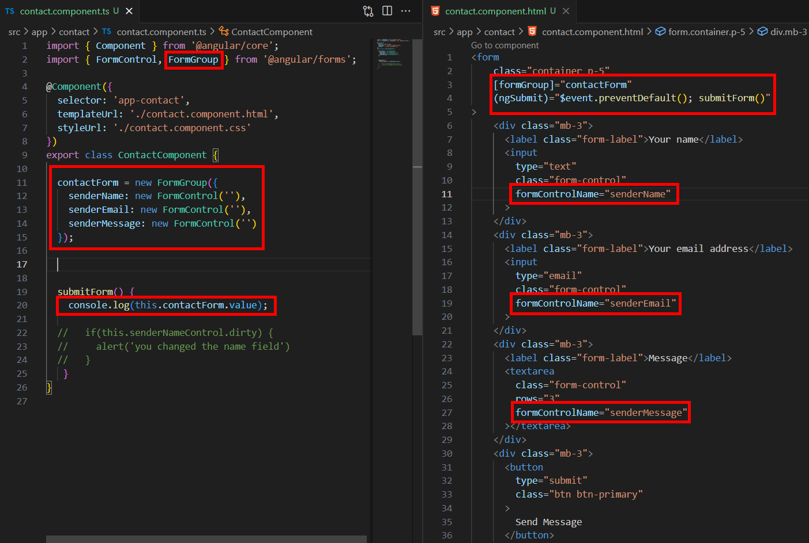
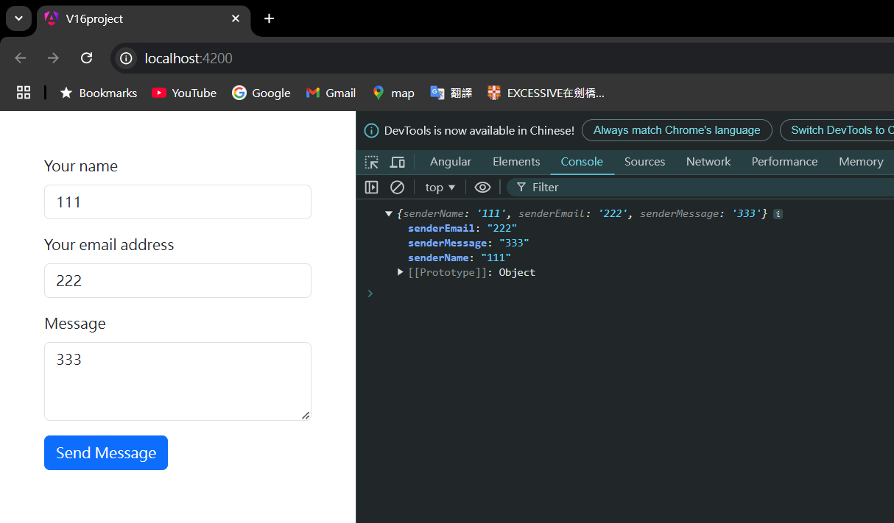

= Creating Control Groups

我們已經創建了一個聯絡表單，並且使用了回應式表單來實現，由於這個聯絡表單的三個欄位是有關聯的，所以將他們分到同一個組是有意義的，這邊我們將引入 "FormGroup" 的概念。

FormGroup 是 Angular 表單框架中的一個核心類，用於管理多個 FormControl 的集合。它通常用於構建和管理複雜的表單，允許開發人員將多個表單欄位組織在一起進行驗證和狀態管理。

我們進行一下的改寫：

* contact.component.ts

- FormGroup：contactForm 是 FormGroup 的實例，它管理多個 FormControl（senderName、senderEmail 和 senderMessage）。

- FormControl：每個 FormControl 對應一個表單欄位，用於管理該欄位的值和狀態。

- submitForm() 方法：在用戶提交表單時，這個方法會被調用，用於輸出整個表單的當前值。

* contact.component.html

- [formGroup]="contactForm"：這個指令將整個表單綁定到 contactForm，這樣表單的值和狀態可以與 FormGroup 保持同步。

- formControlName：每個輸入框和文本區域都使用了 formControlName 來綁定到 FormGroup 中對應的 FormControl。

- (ngSubmit)：這個事件綁定在 <form> 標籤上，用來處理表單的提交。$event.preventDefault() 用於阻止默認的表單提交行為，然後調用 submitForm() 方法。

如此一來在提交表單後可以在控制台看到所輸出的表單的值：

