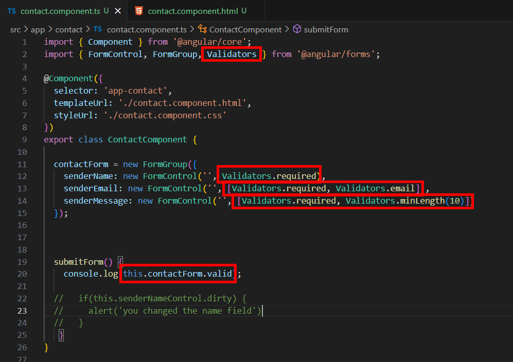
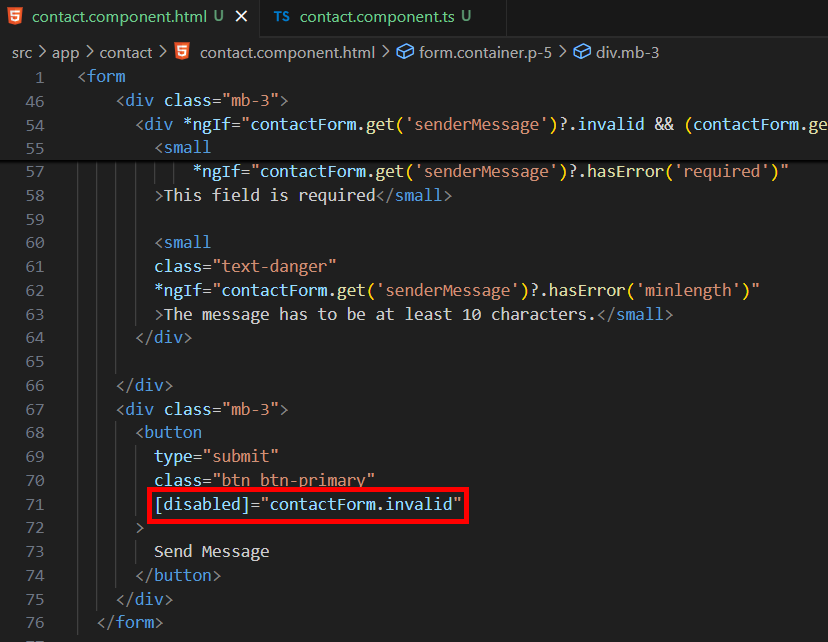

= Validating Reactive Forms

Validators 是 Angular 表單系統中內置的驗證器，用於 Reactive Forms 和 Template-Driven Forms 中，幫助確保表單欄位中的數據符合預期的格式和要求。通過使用 Validators，可以實現多種驗證規則，例如必填、最小值、最大值、 Email 格式等，從而提高應用程序的數據完整性和可靠性。

我們在各個欄位引入對應的驗證器：

* Validators.required：用於驗證字段是否為必填。你已經在 senderName、senderEmail 和 senderMessage 中使用了這個驗證器。

* Validators.email：用於驗證電子郵件的格式。你已經在 senderEmail 中使用這個驗證器，以確保輸入是有效的電子郵件地址。

* Validators.minLength(10)：用於驗證輸入的最小長度。你在 senderMessage 中使用了它，要求消息的最少字符數為 10。

* 在 submitForm() 方法中，你輸出 this.contactForm.valid，這個屬性用於判斷整個表單是否有效。如果所有的欄位都通過驗證，valid 屬性將為 true，否則為 false。

接著我們在模板中添加驗證未通過時的反饋，以 email 部分爲例，在欄位底下添加如下的程式碼：

[source,html]
----

    <small 
        class="text-danger"
        *ngIf="contactForm.get('senderEmail')?.hasError('required')"    
    >This field is required</small>

    <small 
    class="text-danger"
    *ngIf="contactForm.get('senderEmail')?.hasError('email')"    
    >Please enter your email</small>

----

* 最外層的 div 元素使用 *ngIf 指令來顯示表單欄位的驗證錯誤信息，其只會在以下條件成立時顯示：

- contactForm.get('senderEmail')?.invalid：senderEmail 欄位必須處於無效狀態（即輸入不符合驗證規則）。

- (contactForm.get('senderEmail')?.dirty || contactForm.get('senderEmail')?.touched)：欄位必須是已修改（dirty）或已被訪問過（touched）。這樣做是為了防止在表單初始化時直接顯示錯誤信息，只有當用戶與欄位交互過後才顯示錯誤。

* 第一個 small 標簽對應的是 "Validators.required" :

- *ngIf="contactForm.get('senderEmail')?.hasError('required')"：這個 *ngIf 指令用於檢查欄位是否存在 required 錯誤。如果 senderEmail 欄位的值為空並且被標記為必填（即驗證器中使用了 Validators.required），則會顯示這個錯誤信息。
錯誤提示內容為 "This field is required"。

* 第二個 small 標簽對應的是 "Validators.email" :

- *ngIf="contactForm.get('senderEmail')?.hasError('email')"：這個 *ngIf 指令用於檢查欄位是否存在 email 錯誤。
如果 senderEmail 欄位的值不是有效的電子郵件格式，並且驗證器中使用了 Validators.email，則會顯示這個錯誤信息。
錯誤提示內容為 "Please enter your email"。

* "?." 是 JavaScript 和 TypeScript 中的一個語法，稱為可選鏈式操作符（Optional Chaining Operator）。它用來安全地訪問對象的屬性或方法，即使中間連接的某個屬性為 null 或 undefined 也不會導致報錯。

我們可以在提交按鈕上使用 [disabled] 屬性來根據表單的有效性動態控制提交按鈕的可用狀態，確保用戶在表單中有不符合驗證規則的輸入時，不能提交表單。

如此一來我們就用 Angular 内置的驗證器簡單地實現了表單的驗證了。
