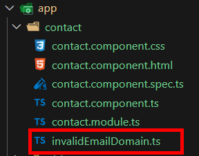
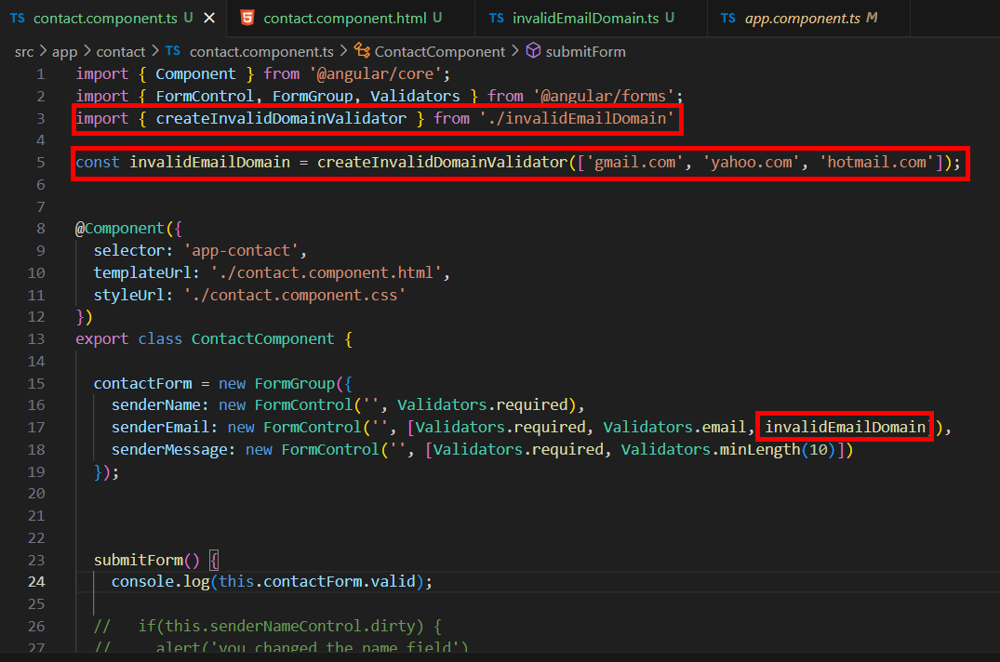
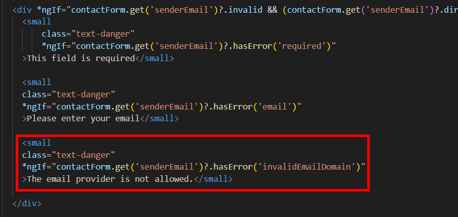
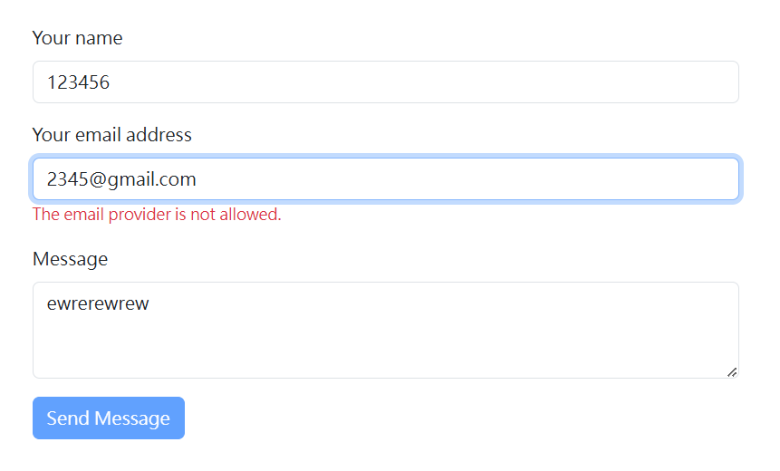

= Writing Custom Validators

儘管 Angular 提供了我們很多驗證器，但有時候某些情況下我們還是會需要編寫自己的驗證邏輯，以符合不同的需求。

比如我們要實現一個特定域名 email 無法使用的功能，我們可以寫一個相關的驗證函式來實現這種客制化的驗證器，我們先在 contact 目錄底下新增一個 invalidEmailDomain.ts：

並在裏面實現對應的驗證邏輯：

[source,typescript]
----
import { AbstractControl, ValidationErrors, ValidatorFn } from "@angular/forms";

export function createInvalidDomainValidator(hosts: string[]): ValidatorFn {
  return (control: AbstractControl): ValidationErrors | null => {
    const value = control.value?.toLowerCase();

    if (!value) {
      return null;
    }

    const matches = hosts.some(host => value.indexOf(`@${host}`) > -1);

    return matches ? { invalidEmailDomain: true } : null;
  };
}
----

* AbstractControl：表示 Angular 表單中的控制項（表單欄位、表單集合等）。

* ValidationErrors：表示驗證器的錯誤結果，通常是一個鍵值對（例如 { [key: string]: any }），用於描述驗證錯誤。

* ValidatorFn：一個函數類型，表示自定義驗證器的類型。它接受 AbstractControl 作為參數，並返回 ValidationErrors 或 null。

* createInvalidDomainValidator(hosts: string[]): ValidatorFn：這是一個工廠函數（Factory Function），接受一個包含無效域名的字串陣列 hosts，並返回一個自定義驗證器函數（ValidatorFn）。

* hosts：表示不允許的電子郵件域名列表。
返回的驗證器函數：

* (control: AbstractControl): ValidationErrors | null => {...}：這是一個箭頭函數，它接受 AbstractControl 作為參數，並根據欄位的值進行驗證。

* const value = control.value?.toLowerCase();：獲取欄位的值並轉換為小寫（如果欄位的值為 null 或 undefined，則 value 為 undefined）。使用 ?.（可選鏈接操作符）來安全地訪問 value。

* if (!value) { return null; }：如果欄位的值為 null 或空字串，則返回 null，表示驗證通過（這樣的設計可以允許空輸入，因為通常由其他驗證器處理空輸入的情況）。

* const matches = hosts.some(host => value.indexOf(@${host}) > -1);：使用 some() 方法來檢查 hosts 列表中是否有與欄位值匹配的域名。value.indexOf(@${host}) > -1：檢查欄位值中是否包含無效的域名。例如，如果 value 是 "user@example.com" 並且 hosts 中有 "example.com"，那麼這個檢查會返回 true。

* return matches ? { invalidEmailDomain: true } : null;：如果 matches 為 true，表示欄位的值包含無效域名，返回一個包含 invalidEmailDomain 的錯誤對象（{ invalidEmailDomain: true }）。如果不匹配，則返回 null，表示驗證通過。

在元件中導入該驗證器並定義無效的域名：

並在模板上添加該驗證錯誤的提示：

如此一來輸入無效的域名就無法通過驗證：

