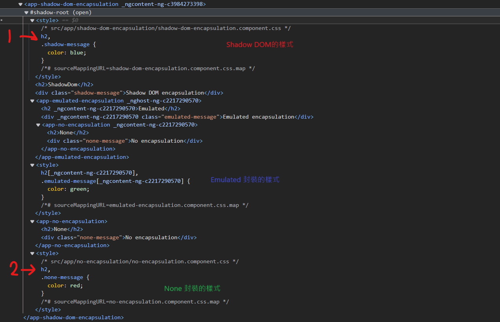

:favicon: ../image/favicon.ico
== Angular ViewEncapsulation

在 Angular 中，元件的 CSS 可以封裝在各自元件的宿主元素中，來讓整體應用程式，不會被部分元件的 CSS 設定所影響。

`Component` 的裝飾器提供了 `encapsulation` 選項，可用來控制每個元件該如何封裝自身的 CSS 。

=== ViewEncapsulation 模式

Angular 中的 `ViewEncapsulation` 主要有以下幾種模式: 

|===
| 模式 | 說明
| **Emulated** | Angular 會修改元件的 CSS 選擇器，在CSS的選擇器後方加上唯一的屬性值並使用 `[]` 包裹住 ，使它們只應用在**有此屬性值的HTML標籤**，不去影響到的其他元素(模擬 Shadow DOM 行為)。
| **None** | Angular 不應用任何形式的View封裝，這意味著為元件指定的任何 CSS 實際上都是全域應用的，並且可以影響應用程式中存在的任何 HTML 元素。這種模式本質上與將 CSS 包含在 HTML 本身中是一樣的。
| **ShadowDom** | Angular 使用瀏覽器內建的 Shadow DOM API 將元件的View與CSS寫到 ShadowRoot(用作元件的宿主元素)中，來隔離 CSS 。
|===

[NOTE]
另外還有一種 **Native** 模式，但在最新版本的 Angular 中已經被移除。

=== 檢視生成的CSS

使用 `ViewEncapsulation.Emulated` 時，Angular會預先處理所有元件的 CSS ，以便它們僅應用於元件的View。

在正在執行的 Angular 應用程式中的DOM中，使用 Emulated 模式的元件的樣板看起來像這樣:

[source,html]
----
<hero-details _nghost-pmm-5>
    <h2 _ngcontent-pmm-5>Mister Fantastic</h2>
    <hero-team _ngcontent-pmm-5 _nghost-pmm-6>
        <h3 _ngcontent-pmm-6>Team</h3>
    </hero-team>
</hero-details>
----

會有兩種屬性 `_nghost` 和 `_ngcontent`，這些屬性是Angular用來標記元件的 CSS 。

|===
| 屬性 | 說明
| **_nghost** | 被新增到包裹元件 View 的元素，這就是原生 Shadow DOM 封裝中的 Shadow Root 。元件的宿主元素通常就是這種情況。
| **_ngcontent** | 被新增到元件 View 中的子元素上，這些屬性用於將元素與其各自模擬的 ShadowRoots(具有對應 `_nghost` 屬性的宿主元素)相對應。
|===

[NOTE]
在經過編譯後，Angular根據元件內的 CSS ，產生唯一的屬性值並自動附加到已有的HTML元素上，這樣就能透過這些屬性把 CSS 跟行為附加到元素上，不需要去做手動新增的動作。

生成後的 CSS 會被添加到 HTML 的 `<head>` 標籤內:

.head標籤內

這些 CSS 經過後期處理，使每個 CSS 選擇器都使用適當的 `_nghost` 或 `_ngcontent` 屬性進行擴充。這些修改後的選擇器可以確保 CSS 以隔離和有針對性的方式應用於元件的檢視。

=== 混合封裝 CSS 

可以針對每個元件使用不同的封裝模式，但不建議這樣做，因為會導致全域 CSS 跟元件 CSS 之間的混亂。

以下是不同封裝模式的元件 CSS 之間會如何互動:

|===
| 模式 | 說明
| **Emulated** | 元件的 CSS 會新增到文件的 `<head>` 中，使它們在整個應用程式中可用，但只會影響它們各自元件中的元素。
| **None** | 元件的 CSS 會新增到文件的 `<head>` 中，使它們在整個應用程式中可用，但是是全域，會影響文件中的其他任何對應元素。
| **ShadowDom** | 元件 CSS 僅新增到 shadow DOM 宿主中，確保它們僅影響各自元件檢視中的元素。
|===

[WARNING]
`ViewEncapsulation.Emulated` 和 `ViewEncapsulation.None` 元件的 CSS 也會新增到每個 `ViewEncapsulation.ShadowDom` 元件的 Shadow DOM 宿主中。 +
這意味著帶有 `ViewEncapsulation.None` 的元件的 CSS 將影響 Shadow DOM 中的對應元素。

=== 例子

==== `ViewEncapsulation.None` 模式

[source,typescript]
----
@Component({
    selector: 'app-no-encapsulation',
    template: `
        <h2>None</h2>
        
No encapsulation

    `,
    styles: ['h2, .none-message { color: red; }'],
    encapsulation: ViewEncapsulation.None,
})
export class NoEncapsulationComponent {}
----

image:../image/no-encapsulation.png[ViewEncapsulation.None]

Angular 將此元件的 CSS 作為全域 CSS 新增到文件的 `<head>` 中。

如前所述，Angular 還會將這些 CSS 新增到所有 Shadow DOM 宿主。因此， CSS 在整個應用程式中都可用。

==== `ViewEncapsulation.Emulated` 模式

[source,typescript]
----
@Component({
    selector: 'app-emulated-encapsulation',
    template: `
        <h2>Emulated</h2>
        
Emulated encapsulation

        <app-no-encapsulation></app-no-encapsulation>
    `,
    styles: ['h2, .emulated-message { color: green; }'],
    encapsulation: ViewEncapsulation.Emulated,
})
export class EmulatedEncapsulationComponent {}
----

image:../image/emulated-encapsulation.png[ViewEncapsulation.Emulated]

與 `ViewEncapsulation.None` 類似，Angular 會將此元件的 CSS 新增到文件的 `<head>` 中，但它們是帶有『作用域』的 CSS 。

只有直接在該元件樣板中的元素才會對應其 CSS 。由於來自 `EmulatedEncapsulationComponent` 的 CSS 是特化的，因此它們會覆蓋來自 `NoEncapsulationComponent` 的全域 CSS 。

在此範例中，`EmulatedEncapsulationComponent` 包含著 `NoEncapsulationComponent`，但 `NoEncapsulationComponent` 仍然如預期般生效了，因為 `EmulatedEncapsulationComponent` 的 **範圍化**  CSS 與其樣板中的元素並不對應。

==== `ViewEncapsulation.ShadowDom` 模式

[source,typescript]
----
@Component({
    selector: 'app-shadow-dom-encapsulation',
    template: `
        <h2>ShadowDom</h2>
        
Shadow DOM encapsulation

        <app-emulated-encapsulation></app-emulated-encapsulation>
        <app-no-encapsulation></app-no-encapsulation>
    `,
    styles: ['h2, .shadow-message { color: blue; }'],
    encapsulation: ViewEncapsulation.ShadowDom,
})
export class ShadowDomEncapsulationComponent {}
----

Angular 僅將此元件的 CSS 新增到 Shadow DOM 宿主，因此它們在 Shadow DOM 之外是不可見的。

[NOTE]
Angular 還將 `NoEncapsulationComponent` 和 `EmulatedEncapsulationComponent` 的全域 CSS 新增到了 Shadow DOM 宿主中，因此這些 CSS 仍然可用於該元件的樣板中的元素。

image:../image/shadow-dom-encapsulation.png[ViewEncapsulation.ShadowDom]

在這個例子中，`ShadowDomEncapsulationComponent` 包含一個 `NoEncapsulationComponent` 和 一個 `EmulatedEncapsulationComponent`，而EmulatedEncapsulationComponent下又包含一個 `NoEncapsulationComponent`。

我們再來看CSS的部分

.CSS被覆蓋

`ShadowDomEncapsulationComponent` 本身的 CSS 在該元件的 Shadow ROOT 中都可使用，並且 `NoEncapsulationComponent` 和 `EmulatedEncapsulationComponent` 也會將自己的 CSS 給新增一份到 Shadow ROOT 中。

`EmulatedEncapsulationComponent` 的 CSS 因為使用屬性值區別的關係，因此該 CSS 不受影響。

但因為 Shadow DOM 只是單純將 CSS 寫在Shadow Root 內來去做隔離  ，在 `<style>` 標籤內並沒有去做相關的隔離措施，並且如同前面的警告內容所說: 被設定成 `ViewEncapsulation.None` 元件的 CSS 會新增到每個 `ViewEncapsulation.ShadowDom` 元件的 Shadow DOM 宿主中。

因此會導致 CSS 被覆蓋的情況發生。

[NOTE]
來源: link:https://v17.angular.io/guide/view-encapsulation[Angular 官方文件^]

link:Class.html[回上一頁]