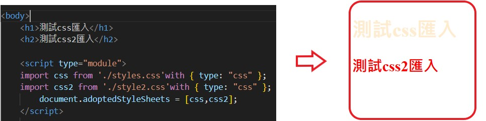
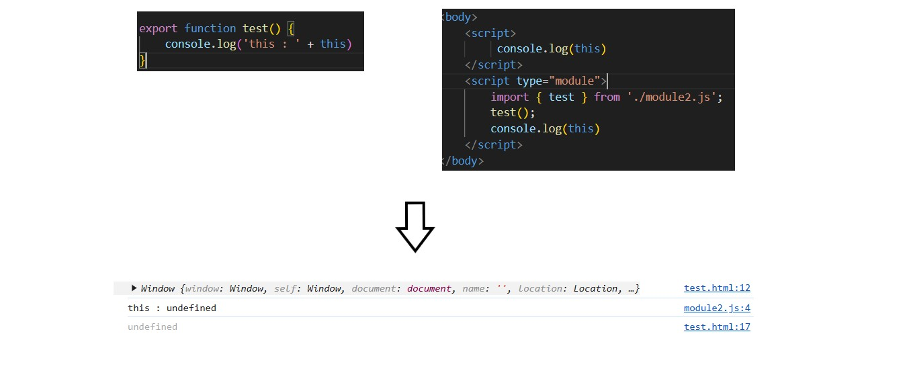
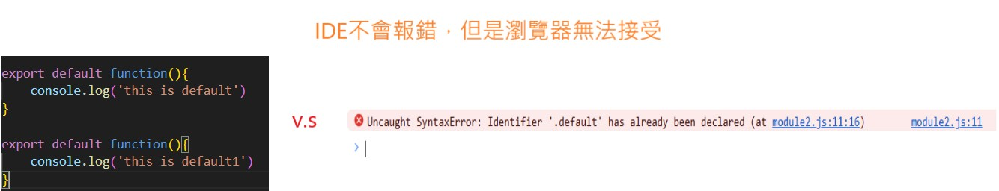

:favicon: ../image/favicon.ico
== ESM

ESM (ECMAScript Modules) 是 JavaScript 的官方標準模組系統。它在 ECMAScript 2015 (ES6) 中被引入，提供了一個標準化的方式來組織和重用 JavaScript 代碼。

(開發時期)angular 用webpack打包後將靜態資源給node.js建立一個http server(負責處理靜態資源和API)，最後是瀏覽器執行轉譯後的js檔案

=== module

JavaScript 程式最初都很小，但隨著時代變化，現在的專案通常有大量的js，故需要模組化的封裝增加

=== mjs

js官方說明: 雖然現在有提供.mjs 這個附檔名來提供辨識此檔案是個module，並且V8文件推薦使用，但是它們不推薦使用

. 有些工具永遠不支援.mjs

### 載入非js檔案

### 與傳統的script不同的地方

模組中的腳本部分可能會與傳統腳本有不同的行為，因為模組會自動使用嚴格模式（strict mode）
故在模組內的this會變成undefined

### Default exports versus named exports

. Default exports一個module只允許一個，這個可以是匿名的
所以不須要具名匯入，不需要"{}"來標示要匯入哪個。

. 例子

[source,javascript]
----
// module
export function test() {
    console.log('this : ' + this)
}

export default function(){
    console.log('this is default')
}
//html
    

----

. 重複宣告export default 

### 重新命名避免名稱衝突

. 可以在export時改名，也可以在import時改名. 

. 例子
[source,javascript]
----

export { function1 as newFunctionName, function2 as anotherNewFunctionName };

import {
  function1 as newFunctionName,
  function2 as anotherNewFunctionName,
} from "./modules/module.js";

----

### 總結

. module內是預設嚴格模式（strict mode），this會指向undefined
. default import

